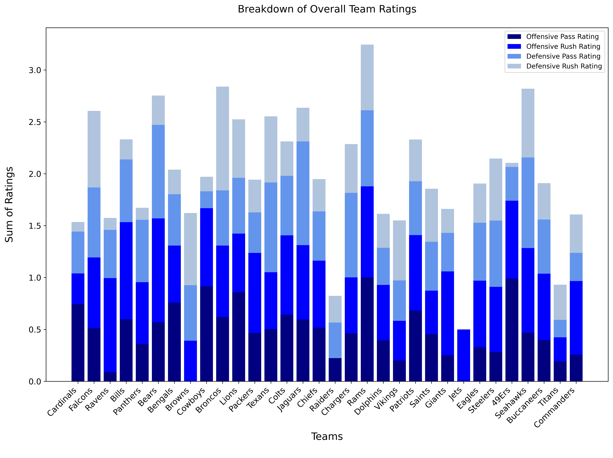

# NFL Prediction Model

This model predicts NFL game outcomes for each upcoming week by generating team ratings from webscraped data directly from NFL.com and applying a linear regression model. These ratings are then used to compare teams and predict the winner of matchups.

---
## Project Content

```
NFLPrediction/
├── Data/                       
├── Examples/
│   └── workflow.ipynb           # Example walkthrough notebook
├── Utils/
│   ├── dataCollection.py        # Fetches and preprocesses NFL data
│   ├── ratingGeneration.py      # Generates team and player ratings
│   ├── modelFitting.py          # Trains and evaluates prediction models
│   └── matchupPredictor.py      # Predicts outcomes for a given matchup
├── .gitignore
└── README.md
```

## Installation & Setup

**Requirements:** Python 3.8+

1. Clone the repository:
   ```bash
   git clone https://github.com/your-username/NFLPrediction.git
   cd NFLPrediction
   ```

2. Install dependencies:
   ```bash
   pip install -r requirements.txt
   ```
---

## Usage

### Running the full workflow

The easiest way to get started is with the example notebook:

```bash
jupyter notebook Examples/workflow.ipynb
```

---

## Results

It is important to note that when predicting matchups for an upcoming week, team ratings from the previous week must be used for the prediction. Below is an example of team ratings from the end of the last NFL season. 



The overall team ratings can then be used to predict matchup outcomes as seen in the example below. 

```bash
matchup("Denver Broncos", "Cleveland Browns", overallRatings)
```

```bash
Projected Winner: Denver Broncos
Denver Broncos: 67.11%
Cleveland Browns: 32.89%
```
---
